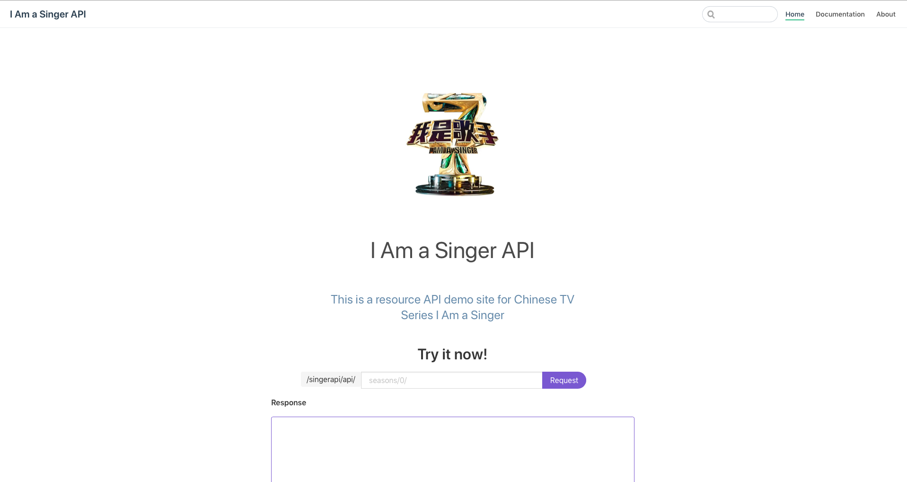

# Singer Server

## Installation

```shell
go install github.com/singerapi/singer-server
```

## Usage

```shell
singer-server
```

Then you can log API Client at site [http://127.0.0.1:8080/singerapi/](http://127.0.0.1:8080/singerapi/)




## Data Resource

网易云音乐网站歌单

我是歌手第一季：https://music.163.com/#/playlist?id=4981163
我是歌手第二季：https://music.163.com/#/playlist?id=158743851
我是歌手第三季：https://music.163.com/#/playlist?id=42180665
我是歌手第四季：https://music.163.com/#/playlist?id=154852370
我是歌手第五季：https://music.163.com/#/playlist?id=706104823
我是歌手第六季：https://music.163.com/#/playlist?id=2055513280